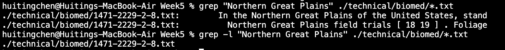
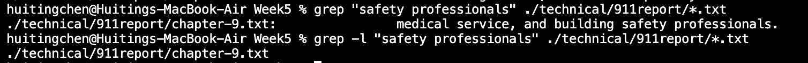
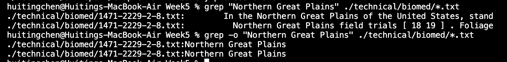

# Commands (Grep)
## -i
-i refers to ignore the case.

In this example, the sentence containing "Three months later" is printed when the string given is "Three months LATER" because -i is used here.

In this example, the sentence containing "Northern Great Plains" is printed when the string given is "northern great plains" because -i is used here.

In this example, the sentence containing "Institutional" is printed when the string given is "INSTITUTIONAL" because -i is used here.
The -i command is useful because sometimes we don't care about the case of letters, -i helps us to deal with this situation.

## -l
-l refers to display file without the contents.

In this example, only 1471-2229-2-8.txt is shown after adding -l command.

In this example, only chapter-9.txt is shown after adding -l command.

In this example, only the files containing "fire" is shown after adding -l command.
-l command helps a lot when we only need the file names without contents. When the contents contain too many words, we may only want the names of files to know the basic information quickly. Or if we want to make a reading list, we may use -l command.

## -o
-o refers to display the string only instead of the whole line.

In this example, instead of printing the whole line, it only prints the string "safety professionals".

In this example, instead of printing the whole line, it only prints the string "Northern Great Plains".

In this example, instead of printing the whole line, it only prints the string "Institutional".
-o command can be useful for counting the time a string appears. 